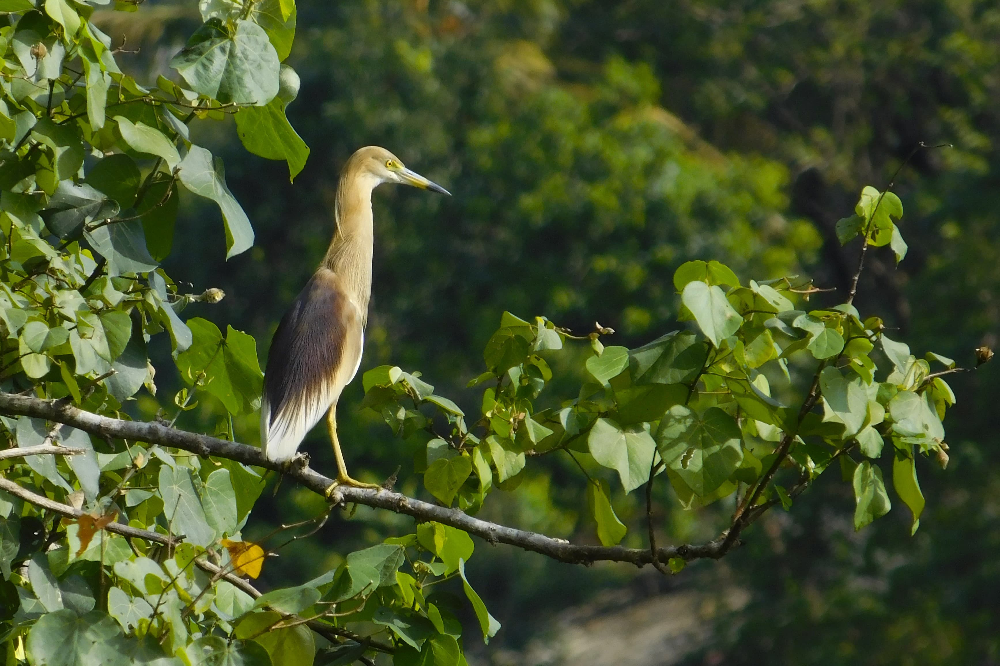

    <picture>
      <source 
        srcset="./uombirds.png"
        media="(prefers-color-scheme: dark)"
      />
      
    </picture>
  

# Releases

Five major releases were taken place as per now.

1. Version 1 - [2024/02/06](https://github.com/chathura-de-silva/Mora-Bird-Diversity/tree/90b7abefd9ce71e4b3a745ed3bfa70afe1ecd1e9)
2. Version 2 - [2024/02/26](https://github.com/chathura-de-silva/Mora-Bird-Diversity/tree/ae68b394233a084ef3c35393f0fe3d2cbe49013d)
3. Version 3 - [2024/04/01](https://github.com/chathura-de-silva/Mora-Bird-Diversity/tree/fa155a0536028179e35c9cf394ab17e9f2288320) 
4. Version 4 - [2024/04/25](https://github.com/chathura-de-silva/Mora-Bird-Diversity/tree/0c5497bd0b695e2e847b7d30e2777fc1b4bf55aa) 
5. Final Version - [2024/05/17](https://github.com/chathura-de-silva/Mora-Bird-Diversity)

There are only two sources you should use to download the PDF versions of the original releases.
* [Onedrive release link](https://chathura-de-silva.github.io/Mora-Bird-Diversity/) (Can be found in the Extended Gallery site)
* [Github releases section](https://github.com/chathura-de-silva/Mora-Bird-Diversity/releases)
# Notes
  * Included Python script is to get the data from the Excel file and then convert them in to a repititive latex list with complex nesting. Generated tex code is saved to `latexcode.tex`.

  * `Document` directory contains the files of latex project of the final document.
  * `Docs` directory contains the files of the static site used to create extended image gallery.

  * When adding new species to the `checklist.tex` you may have to find and replace `"\newpage"` tags.

  * [Find the used base latex template here.](https://www.overleaf.com/latex/templates/unofficial-polytechnic-university-of-leiria-estg-thesis-slash-report-template/tqgbrncfhwgt)

# Known Issues
The python script and `uomBirds.xlsx` is out of sync with the final document. The naming convention an some details has been changed manually. If any records need to be added,
1.  Add them as a record in the `uomBirds.xlsx`.
2. Run the `checkListGenerator.py`
3. Manually copy and paste the relavant code snippets inside the `checklist.tex`.
4. Check for any minor changes in the info/format needed.

#  Gallery

 |   |
:-------------------------:|:-------------------------:|:-------------------------:
  |  |
  |  |

# Copyright & License

* Images should be used (separately on anywhere else) only under the permission of the authors/N-team.
* Publishing or compiling altered versions of the original document with misleading information is not allowed.
* Proper citation whenever using the original infomation of the document is appreciated.
(This repository was made public to make the version history available for anyone.)